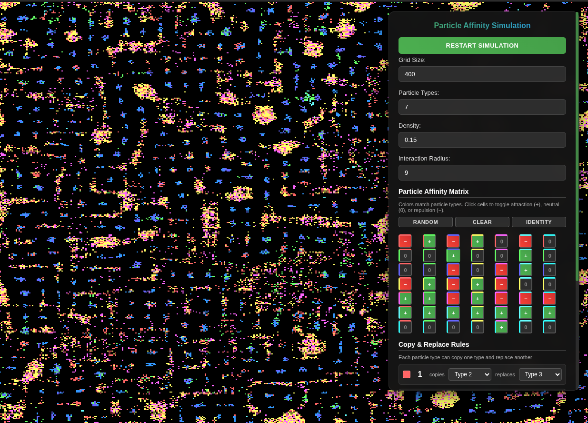

This particle affinity simulation exhibits emergent behavior. 
Each particle type has preferences (affinities) for being near certain other types while avoiding others.

Key Features:

Rust + WASM: High-performance simulation logic compiled to WebAssembly
WebGPU Rendering: Hardware-accelerated graphics for smooth visualization
Scalability: Handles large grids (1000×1000) efficiently (although there is probably more optimization that could be done)
Real-time: 60 FPS simulation and rendering

Particle Behavior:

Particles move to positions that maximize their happiness (affinity score)
Particles can convert certain nearby particles to preferred types
The interaction radius determines how far particles can sense others

Color Coding:

Black represents empty space
Each particle type has a unique color (red, green, blue, yellow, etc.)

build ccommand:
wasm-pack build --target web --out-dir ./www/pkg --out-name particle_affinity_wasm

run local server:
python3 -m http.server --directory www 8080

check it out here:
https://particle-affinity-rust-wasm-webgpu.onrender.com/

Inspiration:
The 'particle affinity' algorithm was described in the following video, although there was no code implementation provided.

https://www.youtube.com/watch?v=xqdVHXkGCAw

